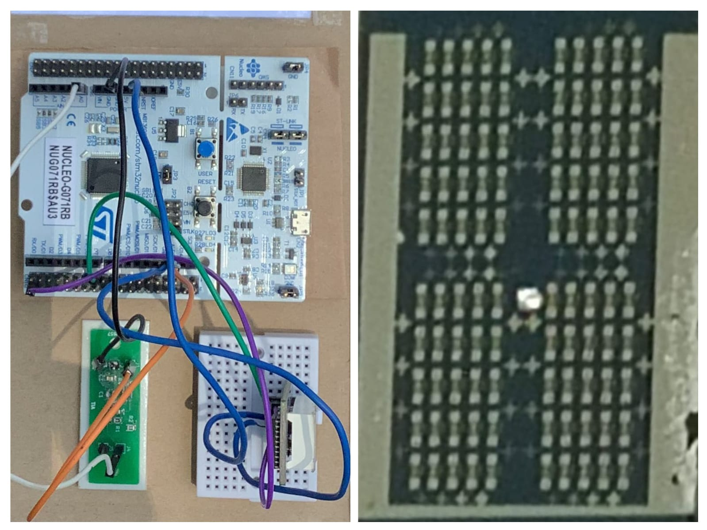

# Sensory Detector of Hazardous Gases
## Industrial Project

### Project Overview
Developed a prototype gas detection system to address ammonia and hydrogen sulphide emissions in poultry farms, which pose risks to both livestock and personnel. The project involved fabricating ZnO thin-film sensors using RF sputtering and photolithography, designing and simulating the amplifier circuit in Proteus and KiCAD, and integrating the system with an STM32 microcontroller. A display module (TM1637) and alarm were added to alert when gas concentration exceeded safe limits.

*Prototype setup showing STM32 NUCLEO-G071RB development board with connected breadboard, custom PCB, and magnified view of the ZnO thin-film sensor array*

### Key Components
- **ZnO Thin-film Sensors** - Fabricated using RF sputtering and photolithography
- **STM32 Microcontroller** - System integration and control
- **TM1637 Display Module** - Real-time gas concentration display
- **Alarm System** - Audio alerts for threshold exceedance
- **Custom PCB** - Designed and simulated in KiCAD and Proteus

### Technologies Used
- STM32 microcontroller
- KiCAD PCB design
- Proteus simulation
- RF sputtering
- Photolithography
- TM1637 display
- C programming

### Applications
- Poultry farm gas monitoring
- Industrial safety systems
- Environmental hazard detection
